# 🤖 Multi-Agent Data Analyst

**🔗 Live App:** [multi-agent-data-analyst.streamlit.app](https://multi-agent-data-analyst-gmj6wumftzhvad3tbyyvp9.streamlit.app/)

An autonomous, multi-agent data analysis system powered by **LangGraph**, **Groq**, and **Streamlit**. Upload any CSV/Excel dataset, ask questions in plain English, and watch specialized AI agents plan, code, analyze, and verify insights — all with full observability.

---

## Architecture

```mermaid
graph TD
    U["👤 User"] -->|upload + query| APP["Streamlit UI"]
    APP -->|invoke| GRAPH["LangGraph StateGraph"]
    
    GRAPH --> PLANNER["🧠 Planner<br/>Breaks query into sub-tasks"]
    PLANNER --> CODER["💻 Coder<br/>Generates & executes pandas code"]
    CODER --> SANDBOX["🔒 Sandbox<br/>Restricted execution environment"]
    SANDBOX --> CODER
    CODER --> ANALYST["📊 Analyst<br/>Synthesizes insights"]
    ANALYST --> CRITIC["🔍 Critic<br/>Fact-checks against data"]
    
    CRITIC -->|✅ PASS| APP
    CRITIC -->|↩️ retry ≤2| CODER
    CRITIC -->|⚠️ escalate| HUMAN["🤚 HumanInput<br/>Asks for clarification"]
    HUMAN --> PLANNER

    style SANDBOX fill:#1a1a2e,stroke:#e94560,color:#fff
    style GRAPH fill:#0f3460,stroke:#16213e,color:#fff
    style APP fill:#533483,stroke:#2b1055,color:#fff
```



### Agent Roles

| Agent | Role | Temperature |
|-------|------|-------------|
| **Planner** | Breaks queries into concrete, pandas-executable sub-tasks | 0.2 |
| **Coder** | Generates Python code and executes in sandbox | 0.1 |
| **Analyst** | Turns code outputs into plain-English, data-backed insights | 0.3 |
| **Critic** | Cross-checks every numerical claim against actual outputs | 0.1 |
| **HumanInput** | Pauses graph for human clarification when needed | N/A |

### State Flow

```
user_query → Planner → sub_tasks → Coder (loop) → code_outputs 
→ Analyst → draft_insight → Critic → verified_insight → User
```

---

## Setup

### Prerequisites
- Python 3.11+
- A [Groq API key](https://console.groq.com/)

### Installation

```bash
# Clone the repository
git clone <repo-url>
cd Agentai

# Create virtual environment
python -m venv venv
venv\Scripts\activate      # Windows
# source venv/bin/activate  # macOS/Linux

# Install dependencies
pip install -r requirements.txt

# Configure environment
cp .env.example .env
# Edit .env and add your GROQ_API_KEY
```

### Generate Sample Data

```bash
python sample_data/generate.py
```

### Run the App

```bash
streamlit run app/main.py
```

Open your browser to `http://localhost:8501`.

---

## Usage

1. **Upload** a CSV or Excel file using the file uploader.
2. **Ask** a question in the chat input (e.g., "What are the top 5 products by revenue?").
3. **Watch** the agents work in the sidebar trace panel.
4. **Respond** if the system asks for clarification (human-in-the-loop).
5. **Review** the verified insight and any generated plots.

---

## Example Queries

Try these with the bundled `sample_data/sales_sample.csv`:

### 1. Basic Aggregation
> **"What are the top 5 products by revenue?"**

The Planner creates sub-tasks to group by product, sum revenue, sort, and display top 5. The Coder generates pandas code, and the Analyst writes a narrative citing actual revenue figures.

### 2. Correlation + Visualization
> **"Is there a correlation between discount and profit margin? Show a scatter plot."**

The system calculates a correlation coefficient and generates a scatter plot with trend line. The Critic verifies the correlation value matches the code output.

### 3. Multi-Step Analysis
> **"Summarize monthly trends and flag any anomalies."**

The Planner breaks this into: parse dates → group by month → calculate metrics → detect anomalies (z-score) → generate trend chart. The Analyst writes a narrative covering seasonal patterns and outliers.

---

## Project Structure

```
Agentai/
├── agents/                    # LangGraph nodes
│   ├── state.py               # Shared TypedDict state schema
│   ├── planner.py             # Query → sub-tasks
│   ├── coder.py               # Sub-task → pandas code → execution
│   ├── analyst.py             # Code outputs → narrative insight
│   ├── critic.py              # Fact-checking & routing
│   ├── human_input.py         # Human-in-the-loop pause
│   └── graph.py               # StateGraph wiring & routing
├── tools/                     # Utilities
│   ├── data_tool.py           # CSV/Excel loader + profiler
│   ├── sandbox.py             # Restricted code executor
│   └── observability.py       # Trace logger decorator
├── app/
│   └── main.py                # Streamlit frontend
├── tests/                     # Unit & integration tests
├── sample_data/               # Demo dataset + generator
├── logs/                      # JSONL trace logs (auto-generated)
├── requirements.txt
├── .env.example
└── README.md
```

---

## Security

The sandbox executor enforces three security layers:

1. **AST Pre-Scan**: Parses code and blocks dangerous function calls (`open`, `exec`, `eval`, `compile`, `__import__`) before execution.
2. **Import Whitelist**: Only allows `pandas`, `numpy`, `matplotlib`, `math`, `statistics`, `datetime`, `json`, `re`, `io`, `base64`, `collections`, `itertools`, `functools`.
3. **Execution Timeout**: 30-second limit (configurable via `SANDBOX_TIMEOUT_SECONDS`).

> **Note**: While these layers provide defense-in-depth, this is NOT a production-grade sandbox. For production use, consider containerized execution (Docker) or a dedicated sandboxing service.

---

## Observability

Every node transition is logged to:
- **In-state `trace_log`**: Consumed by the Streamlit trace panel for real-time display.
- **Disk JSONL files**: `logs/trace_{thread_id}.jsonl` for post-hoc analysis.

Each log entry contains:
```json
{
  "timestamp": "2024-01-15T10:30:45.123Z",
  "node_name": "Coder",
  "input_summary": "query=top 5 products, task_idx=0",
  "output_summary": "updated_keys=[code_outputs, current_task_index]",
  "tokens_used": 0,
  "latency_ms": 1234.56,
  "error": null
}
```

---

## Testing

```bash
# Run all tests
python -m pytest tests/ -v

# Run specific test files
python -m pytest tests/test_sandbox.py -v    # Security tests
python -m pytest tests/test_data_tool.py -v  # Data loading tests
python -m pytest tests/test_graph.py -v      # Integration tests
```

---

## Configuration

| Environment Variable | Default | Description |
|---------------------|---------|-------------|
| `GROQ_API_KEY` | (required) | Your Groq API key |
| `GROQ_MODEL` | `llama-3.3-70b-versatile` | Groq model to use |
| `MAX_RETRIES` | `2` | Max Critic → Coder retries |
| `SANDBOX_TIMEOUT_SECONDS` | `30` | Code execution timeout |
| `MAX_UPLOAD_MB` | `50` | Maximum file upload size |

---

## License

MIT
